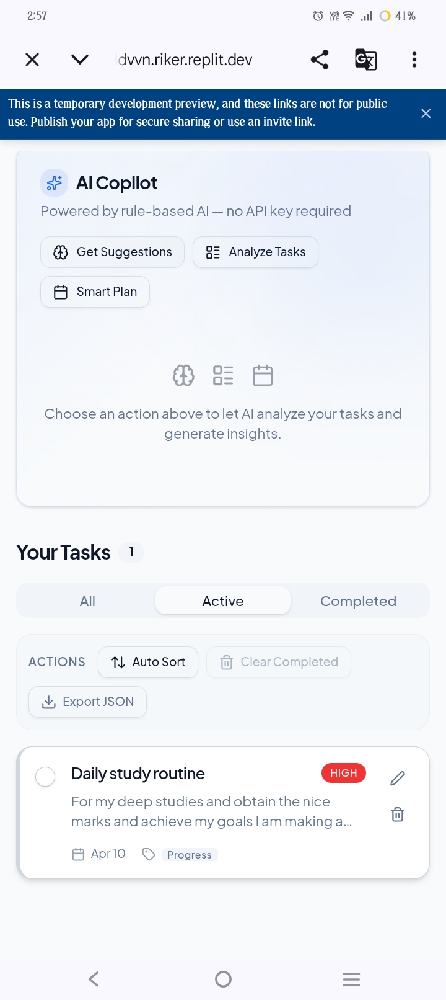
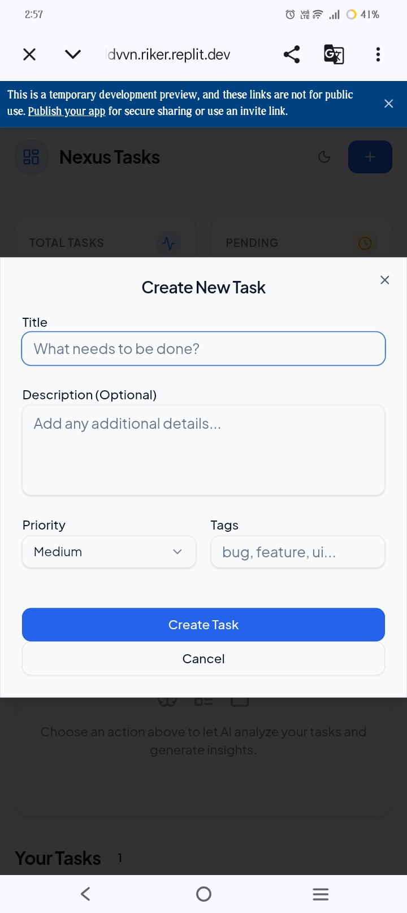

# portfolio
# 👋 Hi, I'm Moshin Reza

🚀 AI-Enhanced Web & Mobile App Developer  
I build modern, scalable, and high-performance applications using AI to deliver faster and better results.

---

## 🧠 About Me

I am a passionate developer with experience in building **web apps, mobile apps, and software systems**.  
I specialize in using **AI tools to speed up development**, improve creativity, and deliver high-quality projects efficiently.

💡 I focus on:
- Fast development using AI
- Clean and modern UI/UX
- Scalable and efficient backend systems

---

## 🧑‍💻 Skills & Technologies

### 🔹 Web Development
- React.js
- Node.js
- PostgreSQL

### 🔹 Mobile Development
- Flutter
- React Native
- Android Development

### 🔹 AI & Automation
- AI Chatbots
- Voice Command Systems
- Automation Tools
- API Integration

---

## 🚧 Projects (Currently in Development)

## 🚀 Project 1: AI Task Manager (Web App)

### 📌 Description
A smart task management web application that helps users organize and manage tasks efficiently. This project was developed using AI-assisted tools to improve speed and productivity.

---

### ⚙️ Features
- Add, update, and delete tasks
- Clean and responsive UI
- Fast performance
- Built with AI-assisted development

---

### 🌐 Live Demo
👉 https://your-replit-link-here

---

### 📸 Screenshots

---

### 💻 Tech Stack
- Frontend: HTML, CSS, JavaScript (or React if used)
- Backend: Node.js (if used)
- Hosting: Replit

---

### 🧠 Development Note
This project was built using AI tools to speed up development and deliver efficient results.
---

### 🔹 AI Voice Messenger (Web App)
- WhatsApp-like interface with AI features
- Users can send messages using voice commands
- Example commands:
  - "Send this image to my friend"
  - "Say hello to Sohail, Krish, and Yuvraj"
- Includes microphone-based smart interaction

---

### 🔹 AI Fitness Tracker (Mobile App)
- Tracks workouts and fitness progress
- AI-based personalized suggestions
- Built using Flutter / React Native

---

### 🔹 AI Chatbot System
- Smart chatbot for answering queries
- Can be integrated into apps or websites
- Built using modern AI APIs

---

## ⚡ What Makes Me Different

✅ I use AI to develop apps faster and smarter  
✅ I deliver projects quicker than traditional development  
✅ I focus on clean UI and real-world usability  
✅ I can build both frontend and backend systems  

---

## 🌍 Availability

💼 Open for **international freelance work**  
🌐 Available for remote projects worldwide  

---

## 📞 Contact Me

📧 Email: moshinreza886@gmail.com  
💻 GitHub: https://github.com/moshinreza886  

---

⭐ I am currently building and uploading my projects. Stay tuned!
