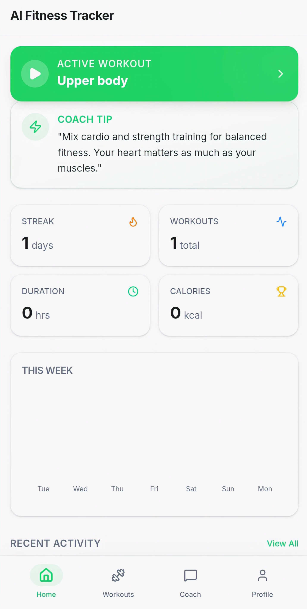
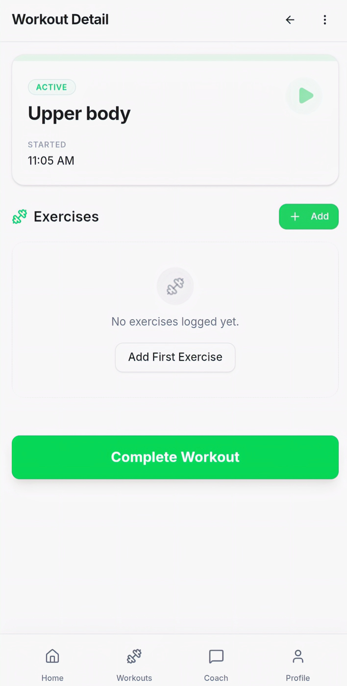
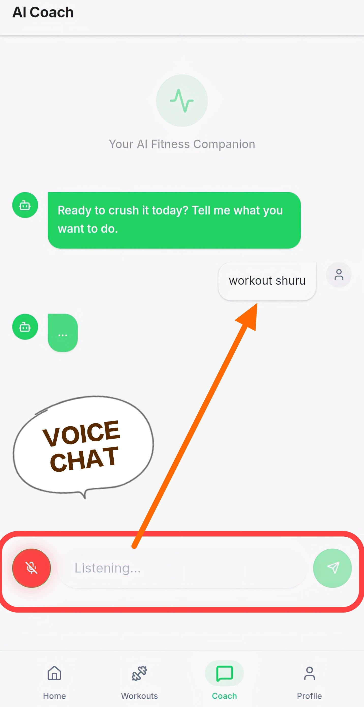
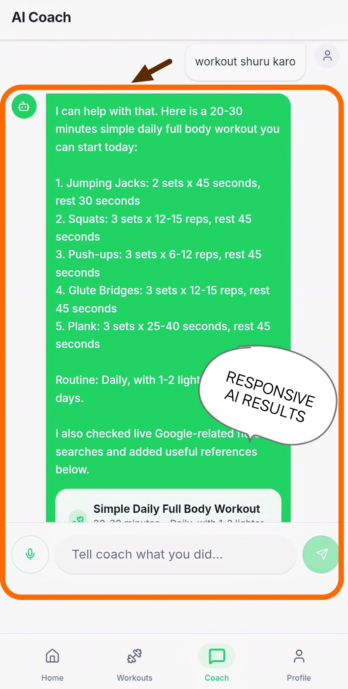
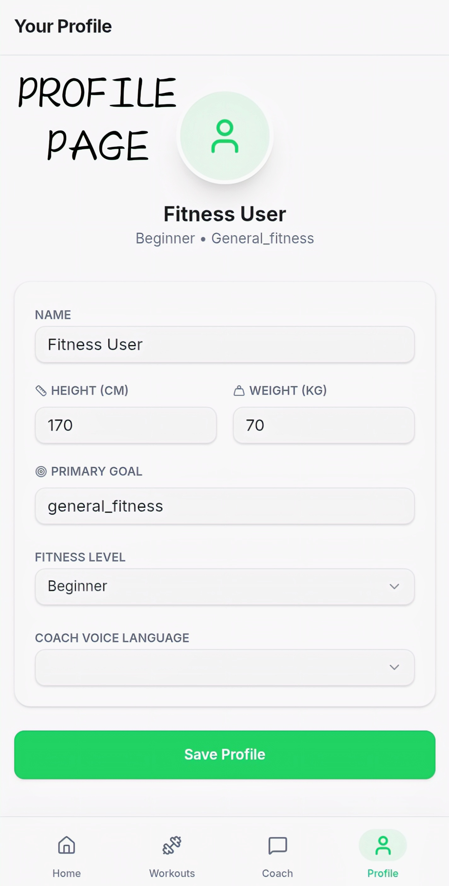
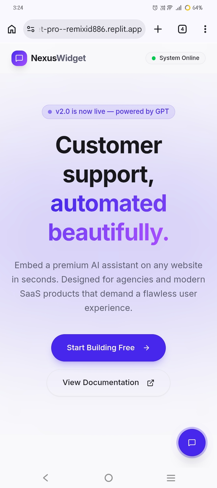
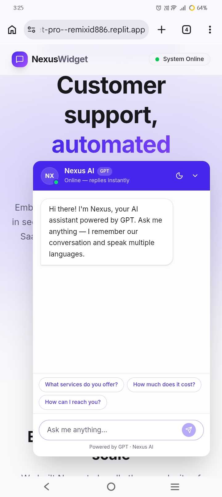
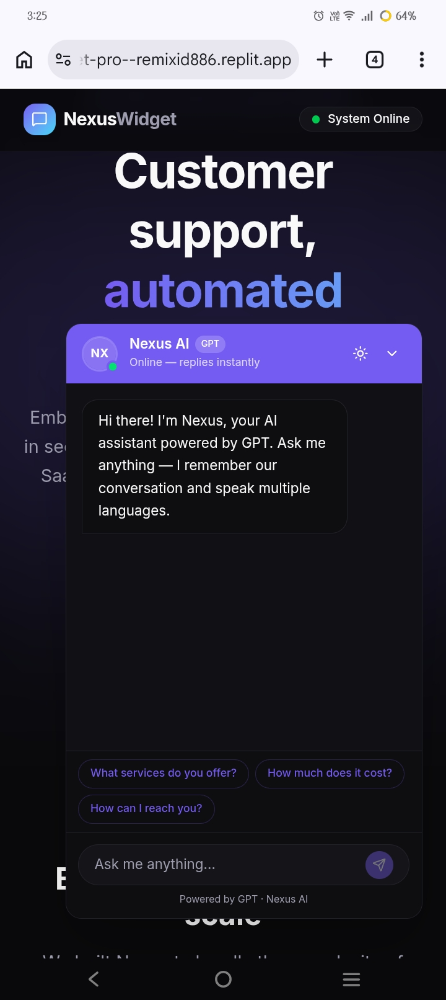

# 👋 Hi, I'm Moshin Reza

🚀 AI-Enhanced Web & Mobile App Developer  
I build modern AI-powered applications using smart development techniques.

---

## 🧠 About Me

I am a passionate developer focused on building real-world AI-based apps.

All my projects are:
- 📱 Built using mobile phone only
- 🤖 Developed with AI tools(less) + my own coding(more)
- 💡 Based on my own ideas and concepts

⚠️ These are **working prototypes**, not full production systems.  
They are built to demonstrate my creativity, problem-solving, and freelancing potential.

Even with limited resources, I have successfully built and deployed **4 advanced AI web apps**.

Now,I have bought a powerful computer system for freelancing now, with better setup, I can deliver **high-quality professional solutions**.

---

# 🚀 Projects

---

## 🚀 1. AI Task Manager

A smart productivity web app designed to help users efficiently manage daily tasks. Built with AI-assisted development to simulate intelligent task handling and improve workflow organization.

### 🌐 Live Demo
👉 https://ai-task-master--moshinreza886.replit.app

### 📸 Screenshots
  
  

### ⚙️ Features
- Add, edit, and delete tasks  
- Clean and responsive UI  
- Fast and lightweight performance  
- AI-inspired task handling logic  

### 💻 Tech Stack
HTML, CSS, JavaScript, Node.js

---

## 🔹 2. AI Voice Messenger

A WhatsApp-inspired real-time messaging application enhanced with a voice-controlled AI system. Users can interact with the app using natural voice commands for a hands-free experience.

### 🌐 Live Demo
👉 https://voice-chat-interface--secondgame886.replit.app/chat

### 📸 Screenshots
  
  
  
  

### ⚙️ Features
- Real-time chat interface (WhatsApp-style)  
- Voice command control system  
- AI-based command interpretation  
- OTP authentication (mock system)  
- Interactive and responsive UI  

### 💻 Tech Stack
HTML, CSS, JavaScript, Node.js, Web Speech API

---

## 🔹 3. AI Fitness Tracker

An advanced AI-powered fitness coach that helps users plan and track workouts using voice commands and multilingual understanding. Designed as a mobile-first experience.

### 🌐 Live Demo
👉 https://voice-coach-hub--subscribeid886.replit.app/

### 📸 Screenshots
  
  
  
  

### ⚙️ Features
- Workout tracking and management  
- AI-generated fitness plans (based on goals)  
- Voice command control system  
- Multilingual AI understanding  
- Smart and interactive fitness assistant  

### 💻 Tech Stack
HTML, CSS, JavaScript, Node.js, Web Speech API

---

## 🔹 4. AI Chatbot System

A reusable AI chatbot widget designed to be embedded into any website. It acts as a smart assistant capable of answering queries and improving user interaction.

### 🌐 Live Demo
👉 https://chat-widget-pro--remixid886.replit.app/

### 📸 Screenshots
  
  

### ⚙️ Features
- Floating chatbot widget UI  
- AI-based response system  
- Knowledge base (FAQ handling)  
- Embeddable script for any website  
- Dark / Light theme support  

### 💻 Tech Stack
HTML, CSS, JavaScript, Node.js

# ⚡ Highlights

- 📱 Built using mobile only  
- 🤖 AI-assisted development  
- 💡 Self-created concepts  
- 🚀 Live deployed projects  

---

# 🌍 Availability

💼 Open for freelance work  
🌐 Available worldwide  

---

# 📞 Contact

📧 moshinreza886@gmail.com  
💻 https://github.com/moshinreza886  

---

⭐ More advanced projects coming soon.