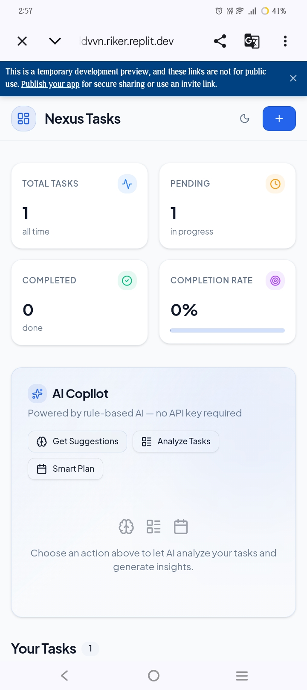
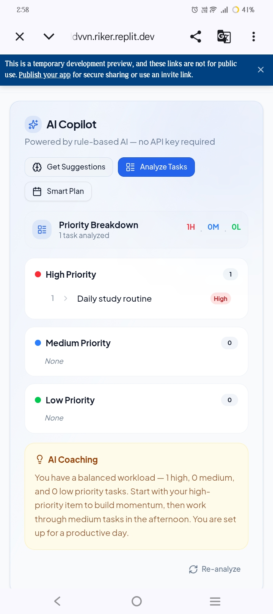
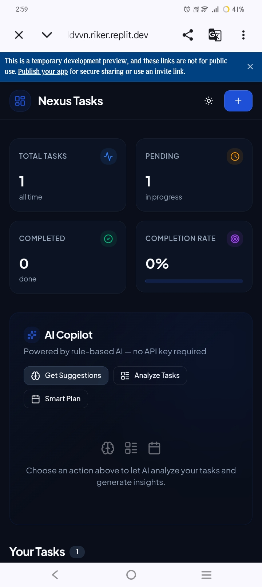
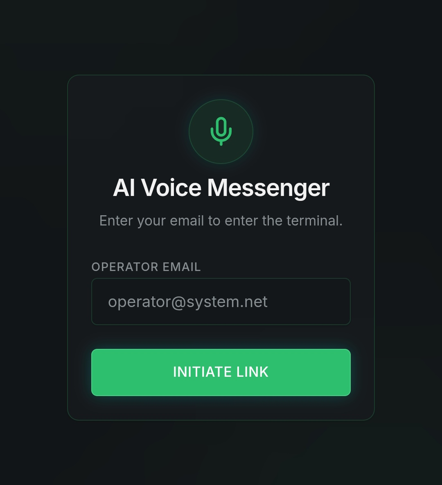
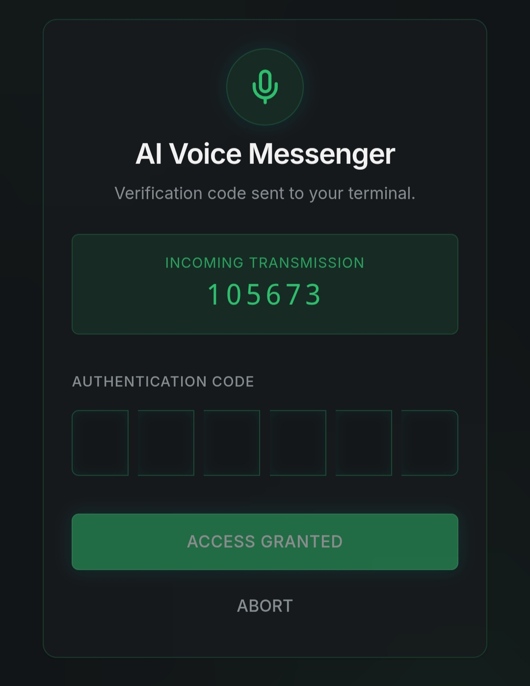
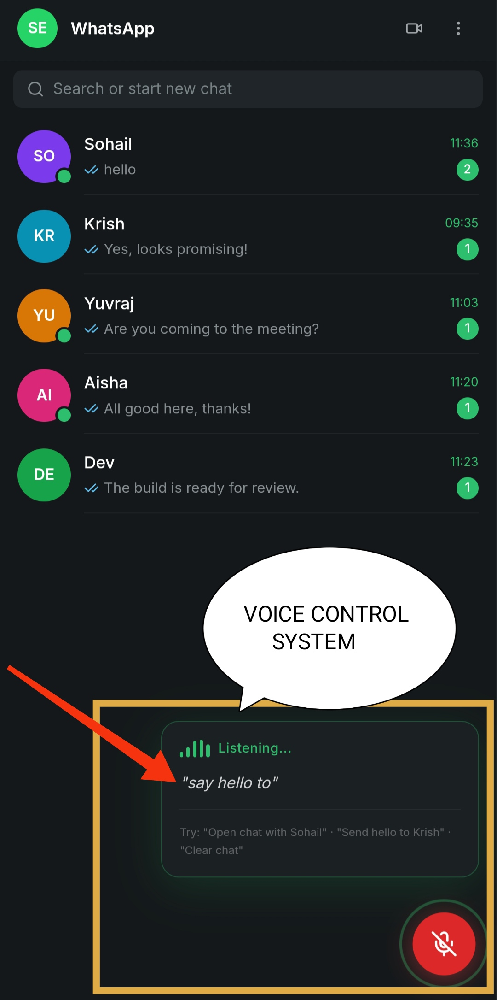
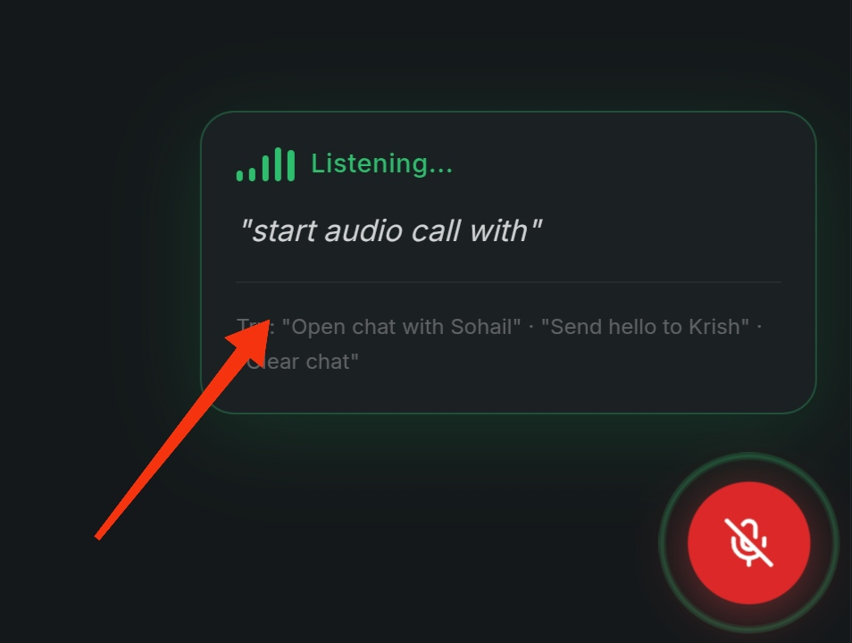
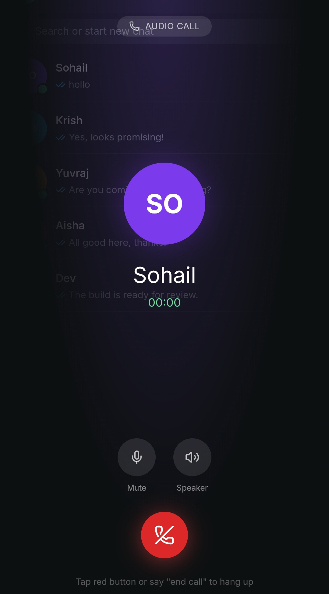

# portfolio
# 👋 Hi, I'm Moshin Reza

🚀 AI-Enhanced Web & Mobile App Developer  
I build modern, scalable, and high-performance applications using AI to deliver faster and better results.

---

## 🧠 About Me

I am a passionate developer with experience in building **web apps, mobile apps, and software systems**.  
I specialize in using **AI tools to speed up development**, improve creativity, and deliver high-quality projects efficiently.

💡 I focus on:
- Fast development using AI
- Clean and modern UI/UX
- Scalable and efficient backend systems

---

## 🧑‍💻 Skills & Technologies

### 🔹 Web Development
- React.js
- Node.js
- PostgreSQL

### 🔹 Mobile Development
- Flutter
- React Native
- Android Development

### 🔹 AI & Automation
- AI Chatbots
- Voice Command Systems
- Automation Tools
- API Integration

---

## 🚧 Projects (Currently in Development)

## 🚀 Project 1: AI Task Manager (Web App)

### 📌 Description
A smart task management web application that helps users organize and manage tasks efficiently. This project was developed using AI-assisted tools to improve speed and productivity.

---

### ⚙️ Features
- Add, update, and delete tasks
- Clean and responsive UI
- Fast performance
- Built with AI-assisted development

---

### 🌐 Live Demo
👉 https://ai-task-master--moshinreza886.replit.app

---

### 📸 Screenshots

1.HOME PAGE LAYOUT

2.USE OF AI IN MANAGEMENT OF TASKS

3.DARK MODE LOOKS

THERE IS MORE TO EXPERIENCE GO FOR LIVE DEMO FROM ABOVE LINK..
---

### 💻 Tech Stack
- Frontend: HTML, CSS, JavaScript
- Backend: Node.js
- Hosting: Replit

---

### 🧠 Development Note
This project was built using AI tools to speed up development and deliver efficient results.
---

## 🔹 AI Voice Messenger (Web App)

A WhatsApp-inspired real-time messaging web application enhanced with AI-powered voice command control system. Users can chat normally or control the entire app using voice commands.

---

## 🧠 Project Overview

AI Voice Messenger is a full-stack web application that combines:
- Chat system (WhatsApp-style UI)
- Voice recognition (Web Speech API)
- AI command processing system
- Authentication (mock OTP system)

The goal of this project is to demonstrate voice-controlled UI interaction and modern chat application design.

---

## ✨ Key Features

### 🔐 Authentication System
- Email-based login/signup
- OTP verification (mock system displayed on screen)
- Session persistence after login

---

### 💬 Chat System
- WhatsApp-like interface
- Contact list (Sohail, Krish, Yuvraj, Aisha, Dev)
- One-to-one messaging system
- Chat bubbles (sender/receiver style)
- Timestamps on messages
- Auto-scroll to latest message

---

### 🎤 Voice Control System (Core Feature)
- Web Speech API integration
- Floating microphone button
- Live speech-to-text conversion
- Real-time voice transcript display

---

### 🧠 AI Command Processing
- Converts voice input into actions
- Understands natural language commands
- Executes UI actions instantly

#### Supported Commands:
- “Send hello to Krish”
- “Open chat with Sohail”
- “Delete last message”
- “Clear chat”
- “Search for Yuvraj”

---

### ⚡ Smart UI Features
- WhatsApp-style dark UI
- Floating microphone button
- Typing indicator (fake simulation)
- Unread message badges
- Toast notifications for actions
- Smooth UI transitions

---

## 🛠️ Tech Stack
- HTML, CSS, JavaScript
- Node.js + Express
- Web Speech API
- JSON / In-memory storage

---

## 🎯 What Makes This Project Unique
- Fully voice-controlled chat system
- AI-based command interpretation
- Real-time UI interaction via speech
- Portfolio-ready WhatsApp clone
- Mobile-friendly responsive design

---

## 🚀 User Flow
1. User logs in with email
2. OTP is shown and verified (mock system)
3. User enters chat dashboard
4. User can:
   - Chat manually
   - OR use voice commands to control everything

---

## 📸 Screenshots

LOGIN PAGE INTERFACE

VERIFICATION PAGE INTERFACE

VOICE CONTROL SYSTEM 

EXAMPLE:AUDIO CALL VIA VOICE CONTROL

AUDIO Call INTERFACE

---

## 🔗 Live Demo

Link:https://voice-chat-interface--secondgame886.replit.app/chat

---

## 🚧 Status

✔ Completed (Working Prototype)  
⚙️ Uses mock data for authentication and messaging  
🚀 Fully functional voice-controlled UI system  

---

### 🔹 AI Fitness Tracker (Mobile-First AI Coach)

An advanced AI-powered fitness tracking application that acts as a personal fitness coach. The app understands voice commands in multiple languages and generates intelligent workout plans based on user goals.

---

## 🧠 Project Overview

AI Fitness Tracker is a mobile-first Progressive Web App (PWA) that combines:
- Workout tracking system
- AI-based fitness coaching
- Voice command control
- Multilingual understanding system

The goal of this project is to simulate a real AI fitness assistant capable of understanding natural human speech across different languages.

---

## ✨ Key Features

### 🏋️ Workout Tracking System
- Create and manage workout sessions
- Track sets, reps, and duration
- Store workout history
- Daily fitness logging

---

### 🎤 Voice Control System
- Microphone-based input (Web Speech API)
- Real-time speech-to-text conversion
- Live transcript display
- Hands-free app control

---

### 🌍 Multilingual AI Intelligence
Supports multiple languages:
- English
- Hindi
- Nepali
- Japanese
- Russian

✔ Understands mixed-language inputs  
✔ Adapts to different speaking styles  

---

### 🧠 AI Fitness Coach (Core Feature)
- Detects user intent instead of fixed commands
- Generates workout plans dynamically
- Provides smart suggestions based on goals

Example:
- “Make a six pack workout plan”
- “Start training now”
- “वर्कआउट सुरु गर”
- “Начать тренировку”

---

### 🤖 Smart AI Behavior
- Never returns “I don’t understand”
- Always generates helpful responses
- Provides:
  - Exercise routines
  - Sets and reps
  - Daily fitness plans
- Motivational coaching responses

---

### 📊 Fitness Dashboard
- Workout summary
- Progress tracking
- Simple analytics UI
- Mobile-first design

---

## 🛠️ Tech Stack
- Frontend: HTML, CSS, JavaScript (Mobile-first UI)
- Backend: Node.js + Express
- Voice: Web Speech API
- AI System: Rule-based NLP + intelligent fallback engine
- Storage: JSON / in-memory database

---

## 🎯 What Makes This Project Unique
- Multilingual AI voice understanding system
- Natural language fitness coaching
- Hybrid AI (intent + fallback intelligence)
- Real-time voice-controlled UI
- Portfolio-level AI product simulation

---

## 🚀 Live Demo

👉 https://voice-coach-hub--subscribeid886.replit.app/

---

## 📸 Screenshots

(Add your screenshots here)
- Dashboard UI
- Voice input active
- AI response output
- Workout tracking screen

---

## 🚧 Status

✔ Completed (Advanced Prototype)  
🚀 Fully functional AI fitness coach  
🌍 Multilingual voice intelligence implemented  

---

### 🔹 AI Chatbot System
- Smart chatbot for answering queries
- Can be integrated into apps or websites
- Built using modern AI APIs

---

## ⚡ What Makes Me Different

✅ I use AI to develop apps faster and smarter  
✅ I deliver projects quicker than traditional development  
✅ I focus on clean UI and real-world usability  
✅ I can build both frontend and backend systems  

---

## 🌍 Availability

💼 Open for **international freelance work**  
🌐 Available for remote projects worldwide  

---

## 📞 Contact Me

📧 Email: moshinreza886@gmail.com  
💻 GitHub: https://github.com/moshinreza886  

---

⭐ I am currently building and uploading my projects. Stay tuned!
